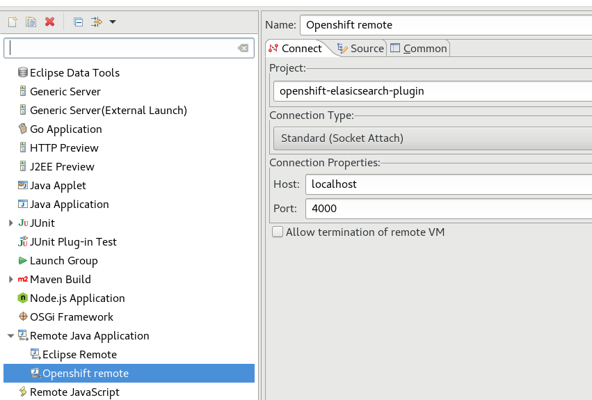
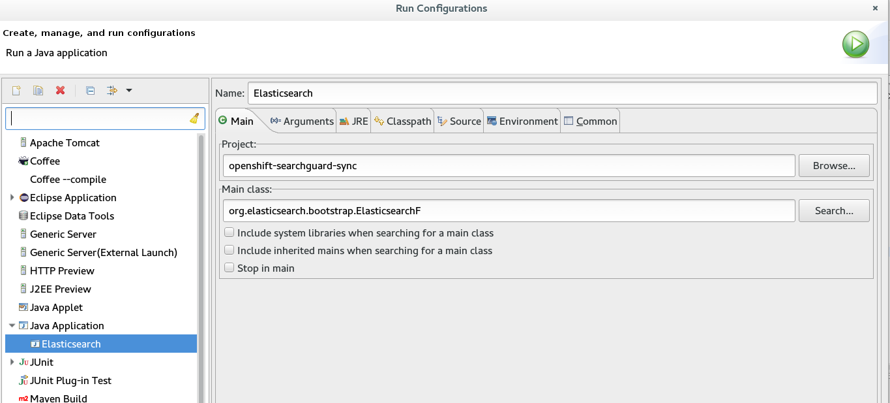
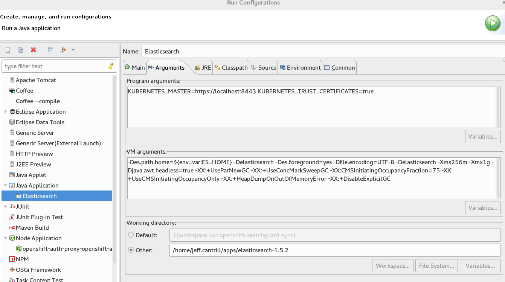
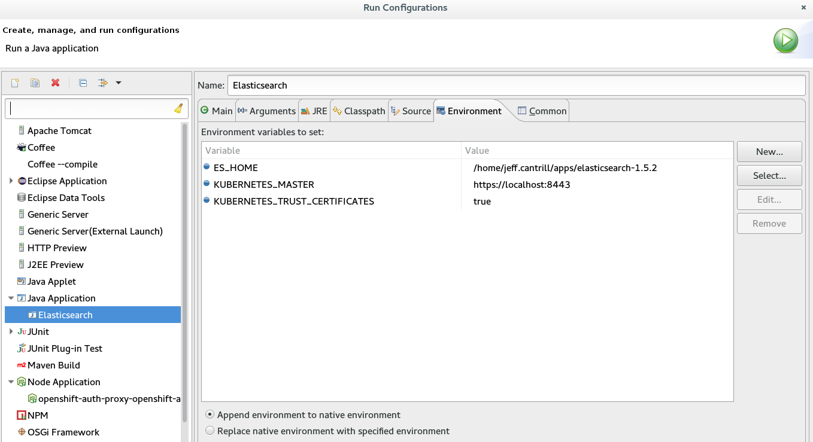

# OpenShift ElasticSearch plugin
This is an OpenShift plugin to ElasticSearch to:

* Dynamically update the SearchGuard ACL based on a user's name
* Transform kibana index requests to support multitenant deployments for 
  non-operations users when so configured.


*Note:*
Previous versions of this plugin created a Kibana profile for each user regardless of their role,
which is still the default mode of operation.  It is now possible to configure the Kibana index mode 
to allow [operations users](./src/main/java/io/fabric8/elasticsearch/util/RequestUtils.java) to share the Kibana index to store dashboards and visualizations.  It is highly 
recommended that operations teams establish agreements and naming conventions so users do not 
overwrite each others work.

## Configuring your initial ACLs
With the update to use Searchguard-2 and Searchguard-SSL for ES 2.4.x, the
OpenShift-Elasticsearch-Plugin assumes the initial ACLs are seeded when the cluster is started.

### Action Groups

This plugin will produce role and role mappings that assume certain action groups are defined with
the base SearchGuard ACL documents.  [Samples](./src/test/resources/io/fabric8/elasticsearch/plugin/roles_ops_shared_kibana_index_with_unique.yml) 
of what the generated roles are found with the unit tests


You can view sample ACL document configurations [here](./samples/).

As with `sgadmin`, the plugin needs to use the certificate with a DN that matches
the `searchguard.authcz.admin_dn` as defined in the ES config to be able to
update the Searchguard index. You can specify the certificate and truststore information
for the esClient with the following properties.

|Property|Description|
|-------|--------|
|*_openshift.searchguard.keystore.path_*|The certificate that contains the cert and key for the admin_dn. Default: *_/usr/share/elasticsearch/config/admin.jks_*|
|*_openshift.searchguard.truststore.path_*|The truststore that contains the certificate for Elasticsearch. Default: *_/usr/share/elasticsearch/config/logging-es.truststore.jks_*|
|*_openshift.searchguard.keystore.password_*|The password to open the keystore. Default: *_kspass_*|
|*_openshift.searchguard.truststore.password_*|The password to open the truststore. Default: *_tspass_*|
|*_openshift.searchguard.keystore.type_*|The file type for the keystore. JKS or PKCS12 are accepted. Default: *_JKS_*|
|*_openshift.searchguard.truststore.type_*|The file type for the truststore. JKS or PKCS12 are accepted. Default: *_JKS_*|

## Configure the projects for '.operations'
You can configure which projects are deemed part of the .operations index for ACL
configuration.

In your config file:
```
openshift.operations.project.names: ["default", "openshift", "openshift-infra"]
```

The [defaults](https://github.com/fabric8io/openshift-elasticsearch-plugin/blob/master/src/main/java/io/fabric8/elasticsearch/plugin/ConfigurationSettings.java#L78) must all be in lower-case to be properly matched.

## Additional Configuration Parameters
The following additional parameters can be set in set in `elasticsearch.yml`:

|Property|Description|
|-------|--------|
|*io.fabric8.elasticsearch.acl.sync_delay_millis*|The delay in milliseconds before the SG AGL document is resynced with OpenShift|
|*io.fabric8.elasticsearch.acl.user_profile_prefix*| The prefix to use to store Kibana user visualizations (default: `.kibana.USERUUID`)|
|*io.fabric8.elasticsearch.kibana.mapping.app*| Absolute file path to a JSON document that defines the index mapping for applications| 
|*io.fabric8.elasticsearch.kibana.mapping.ops*| Absolute file path to a JSON document that defines the index mapping for operations|
|*io.fabric8.elasticsearch.kibana.mapping.empty*| Absolute file path to a JSON document that defines the index mapping for blank indexes|
|*openshift.config.project_index_prefix*| The string value that project/namespace indices use as their prefix (default: ``) for example, with the common data model, if the namespace is `test`, the index name will be `project.test.$uuid.YYYY.MM.DD`.  In this case, use `"project"` as the  prefix - do not include the trailing `.`.|
|*openshift.kibana.index.mode*| The setting that determines the kibana index is used by users.  Valid values are one of the following: <ul><li>**unique** (Default) - Each user gets a unique index for kibana visualizations (e.g. .kibana.USER_UUID)</ul></li><ul><li>**ops_shared**       - Users who are in an ops role will share an index (e.g. kibana) while non ops users will have a unique index (e.g. .kibana.USER_UUID)</ul></li>|

*Note*: The `io.fabric8.elasticsearch.kibana.mapping.*` properties are required and must be defined for the plugin to function. A sample file
may be found in the `samples` folder.

## Development
Manually install custom version of SearchGuard

* `$ mvn install:install-file -Dfile=lib/search-guard-5-5.5.2-15-rh.jar  -Dpackaging=jar`

Following are the dependencies

* [ElasticSearch] (https://github.com/elastic/elasticsearch/tree/5.5.2)
* [Search-Guard] (https://github.com/floragunncom/search-guard/tree)
* [Search-Guard-SSL] (https://github.com/floragunncom/search-guard-ssl/tree)

### Remote Debugging deployed to Openshift

* Edit the Elasticsearch deployment config:
```
$oc edit dc/$ES_DCNAME

```
* Add environment variable:

```
...
    spec:
      containers:
      - env:
        - name: ES_JAVA_OPTS
          value: -Xdebug -Xrunjdwp:transport=dt_socket,server=y,suspend=n,address=4021
...
``` 
* Forward the debug port 
```
oc port-forward $ES_PODNAME 4000:4021
```
* Attach Eclipse debugger to forwarded port


### Debugging and running from Eclipse
*Note:* Mileage may vary here as this has not been verified since the plugin was compatible with ES1.7x 
* Install ES

* Create a run configuration
 * Main Class
 

 * VM args:

 ````-Des.path.home=${env_var:ES_HOME} -Delasticsearch -Des.foreground=yes -Dfile.encoding=UTF-8 -Delasticsearch -Xms256m -Xmx1g -Djava.awt.headless=true -XX:+UseParNewGC -XX:+UseConcMarkSweepGC -XX:CMSInitiatingOccupancyFraction=75 -XX:+UseCMSInitiatingOccupancyOnly -XX:+HeapDumpOnOutOfMemoryError -XX:+DisableExplicitGC````



 * Environment Variables:

   
